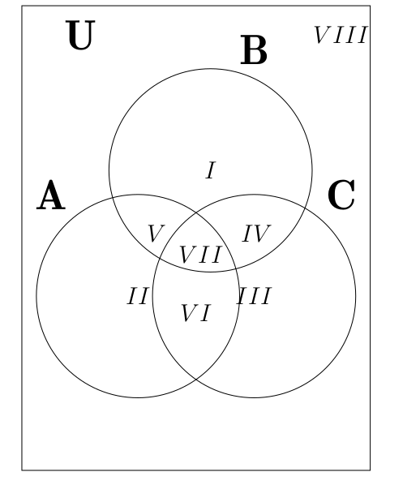

```{r setup, include=FALSE}
knitr::opts_chunk$set(echo = TRUE)
```

\section*{Introducción}

\newpage
\thispagestyle{empty}

\section*{Sobre el curso de Álgebra y Geometría Analítica para Ciencias de la Salud}

\newpage
\thispagestyle{empty}

\section*{Agradecimientos}

\printindex

\newpage

# Teoría de Conjuntos

## Elementos b\'asicos

\begin{Def}
La unión de dos conjuntos $A$ y $B$, $A\cup B$ es el conjunto formado por los elementos en $U$, que pertenecen a $A$ o $B$ o ambos
\begin{eqnarray}
A\cup B = \left\{x\in U| x\in A, x\in B, \textrm{o ambos}\right\}
\end{eqnarray}
\end{Def}


\begin{Def}
La intersección de dos conjuntos $A$ y $B$, $A\cap B$ es el conjunto formado por los elementos en $U$, que pertenecen a $A$ y $B$ simultáneamente
\begin{eqnarray}
A\cap B = \left\{x\in U| x\in A\textrm{ y } x\in B\right\}
\end{eqnarray}
\end{Def}

\begin{Def}
El complemento de un conjunto $A$ es el conjunto formado por los elementos en $U$, que no pertenecen a $A$
\begin{eqnarray}
A^c = \left\{x\in U| x\notin A\right\}
\end{eqnarray}
\end{Def}


\begin{Def}
La diferencia de dos conjuntos $A$ y $B$, $A-B$ es el conjunto formado por los elementos en $U$, que pertenecen a $A$ y que no pertenecen a $B$
\begin{eqnarray}
A- B = \left\{x\in U| x\in A\textrm{ y } x\notin B\right\}
\end{eqnarray}
\end{Def}


\begin{Def}
La cardinalidad de un conjunto $A$, es el número de elementos que contiene el conjunto, y se denota por $n\left(A\right)$
\end{Def}

\begin{Prop}
Sean $A$ y $B$ conjuntos en $U$, si
\begin{itemize}
\item Si $A\cap B=\emptyset$, entonces 
\begin{eqnarray}
n\left(A\cup B\right)=n\left(A\right)+n\left(B\right)
\end{eqnarray}
\item Si $A\cap B\neq \emptyset$, entonces 
\begin{eqnarray}
n\left(A\cup B\right)=n\left(A\right)+n\left(B\right)-n\left(A\cap B\right)
\end{eqnarray}
\end{itemize}
\end{Prop}

\begin{Prop}
Sean $A$, $B$ y $C$ conjuntos en $U$, se tienen las siguientes propiedades
\begin{eqnarray}
A\cap (B\cup C)&=& (A\cap B) \cup (A\cap C)\\
A\cup (B\cap C)&=& (A\cup B) \cap (A\cup C)\\
(A\cup B)^c&=& A^c \cap B^c\\
(A\cap B)^c&=& A^c \cup B^c\\
A-B&=&A\cap B^c
\end{eqnarray}
\end{Prop}

Finalmente, para tres conjuntos $A$, $B$ y $C$ se tiene el siguiente gráfico

{ width=250px }

\begin{Prop}
Sean $A$, $B$ y $C$ conjuntos en $U$, entonces
\begin{eqnarray}
n\left(A\cup B\cup C\right)= n\left(A\right)+n\left(B\right)+n\left(C\right)-n\left(A\cap B\right)-n\left(A\cap C\right)-n\left(B\cap C\right)+n\left(A\cap B \cap C\right)
\end{eqnarray}
\end{Prop}

  
## Operaciones entre conjuntos


### Operaciones entre conjuntos: elementos son categorías
